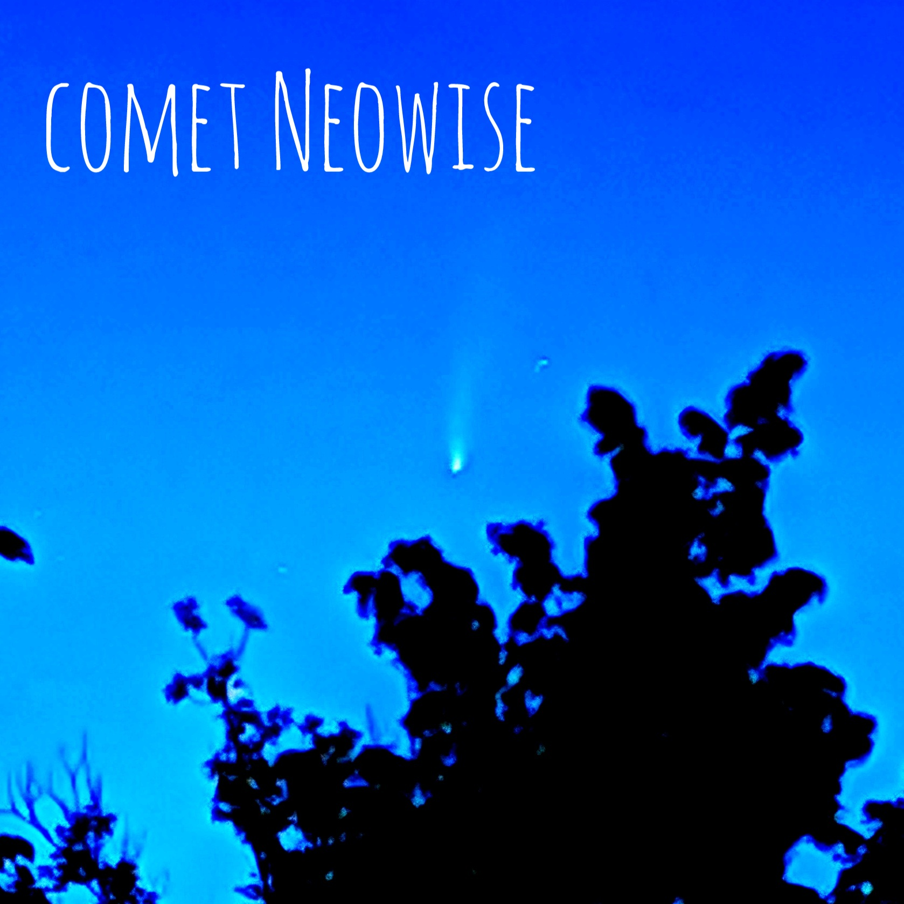
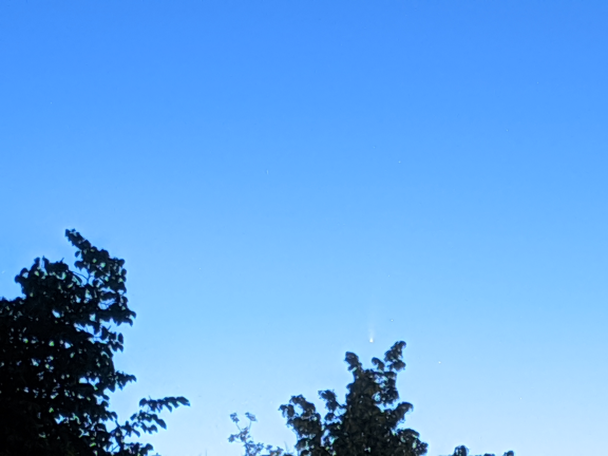
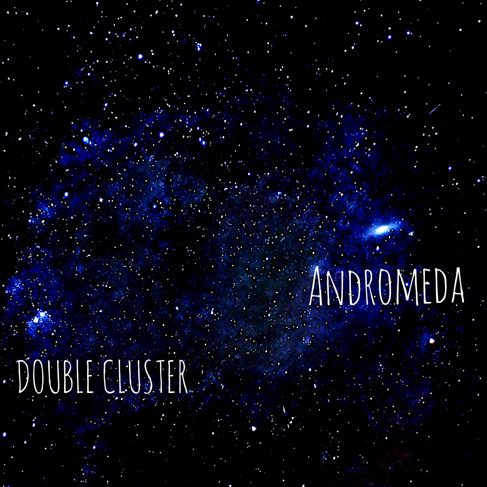

The summer of 2020 was bittersweet. Despite the continuing ramifications from COVID-19, the night sky managed to put on a show for a lifetime, uniting people under very stressful times.
Intrigued by what the astrophotography mode could offer in my Pixel 3 XL, I decided to embrace the night sky and explore how I can enthuse the kid within me that once fell in love with astronomy. 
And boy, did I come in for a surprise..

# Comet NEOWISE

In July 2020, Comet NEOWISE took the astronomy world by surprise when it suddenly lit up in the night sky as it tumbled towards the Sun in its 6,766 year round-trip. As the skies cleared up on one July evening in Nijmegen, I decided that that was the night I would stay awake to hunt and capture the comet. It was around 03:45 in the morning when I spotted the comet with my naked eyes. I was flipping between different sky maps on my Android device and fervently calibrating the sensors in my phone to spot Capella. When I did spot Capella, it was just a matter of seconds before I saw the comet hanging in the early dawn sky with its unmistakeable tail. A frantic few minutes followed as I put together a series of contraptions to ensure the comet was within the field of view of my phone.

I wish I had stepped out into the open fields to capture this beauty. The Sun was rising fast and the window of opportunity was closing.

# Andromeda

There is something mystical about the Andromeda galaxy. Edwin Hubble's observations of Cepheid variables in the Andromeda galaxy also provided substantial evidence towards the fact that the great "nebula" in Andromeda was actually extragalactic in nature, further uncovering a larger, grander, and a humbling universe. It is moving towards us at a speed of 110km per second and is predicted to collide and merge with our Milky Way galaxy in ~4.5 billion years, like dancing partners twirling into each other's arms.

Image produced by stacking 10 images of one minute exposures using Sequator. It's amazing what Google's astrophotography mode can capture these days. Kudos to the Google AI team for producing a modern day marvel. A few decades ago, it must have been hard to imagine that pocket phones could capture the structures of Andromeda today.
